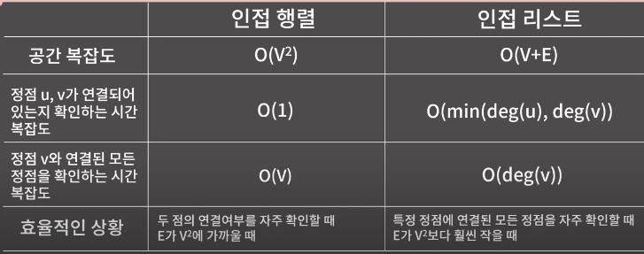

연결 그래프: 임의의 서로 다른 두 정점에 대하여, 간선을 통한 접근이 가능한 그래프
그래프는 연결되어 있다 / 그래프는 연결 그래프이다 => 연결 그래프

단순 그래프: 두 정점 사이의 간선이 1개 이하이고 루프가 존재하지 않는 그래프
두 정점 사이의 간선은 1개만 존재한다 => 단순 그래프
같은 간선은 한 개만 주어진다 => 단순 그래프
간선의 두 정점은 서로 다르다 => 루프가 없다 => 단순 그래프
간선은 서로 다른 두 정점을 연결한다 => 루프가 없다 => 단순 그래프

그래프 표현:
* 인접행렬: 서로 다른 두 정점에 대한 연결관계를 표현
* 인접리스트: 각 정점에 대한 동적 배열 할당

