https://blog.encrypted.gg/921
https://github.com/encrypted-def/basic-algo-lecture

  

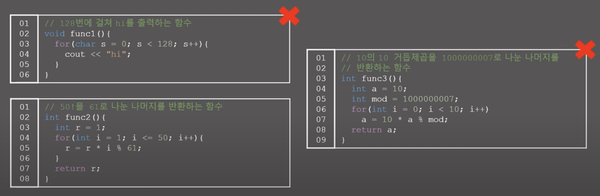  

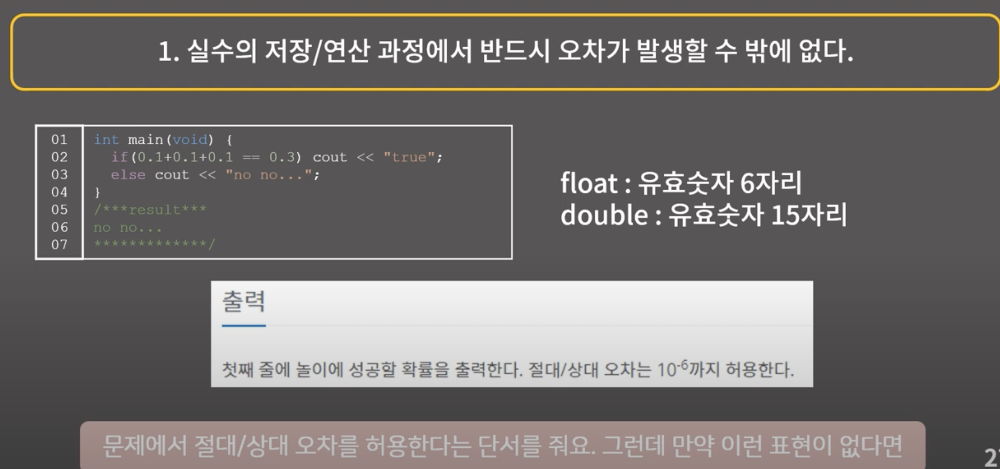  

  

  

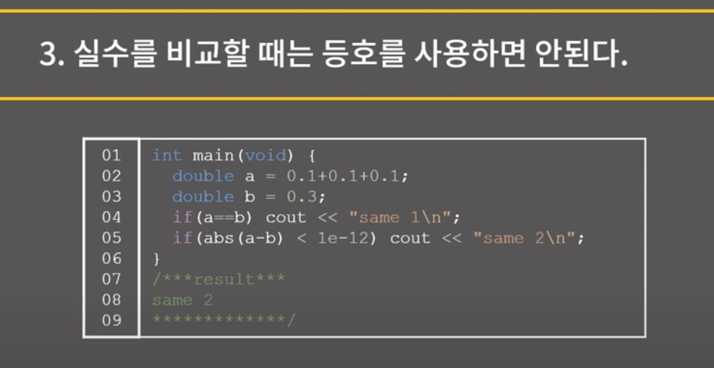  

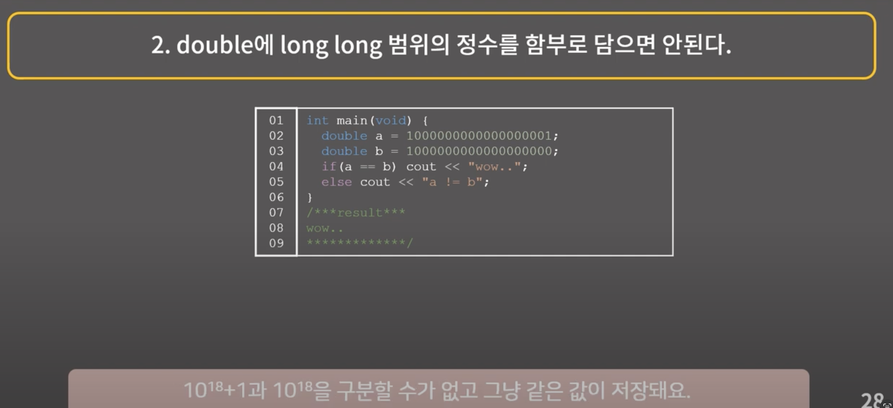  

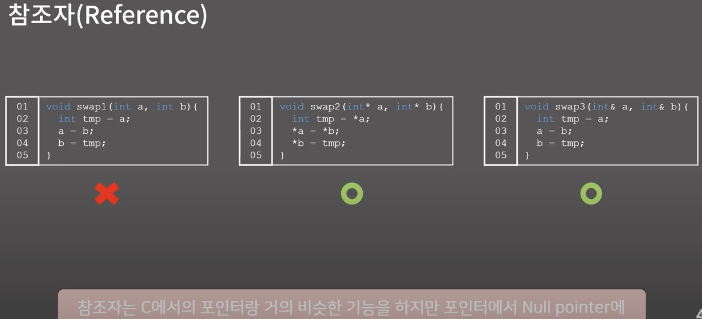  

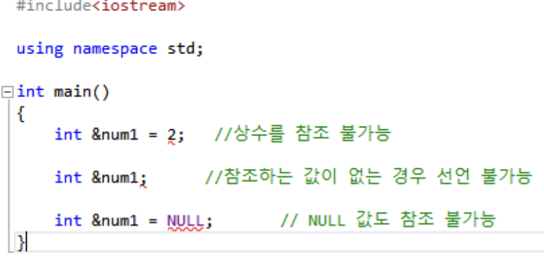  

참조자는 상수 안되고 NULL 안되고 값이 배열같은 변수여야 함.

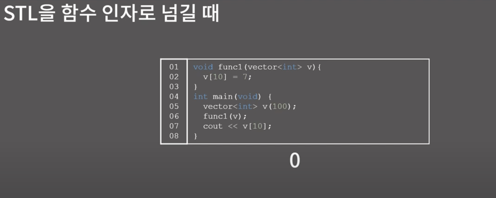  

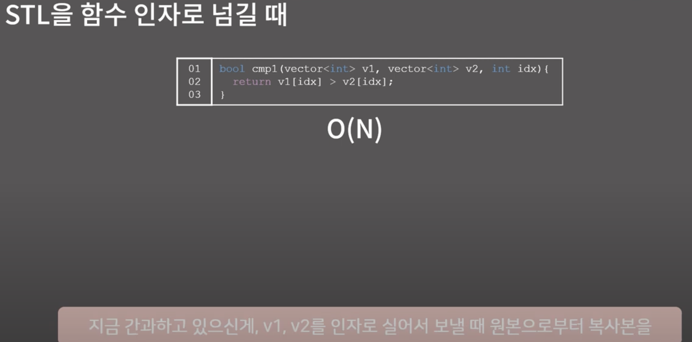  
벡터 두개를 복사하는 데 걸리는 시간 O(n)

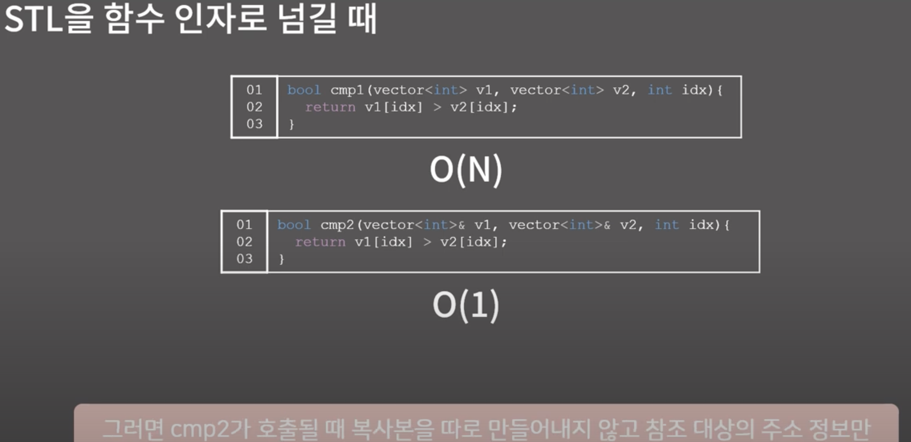  
참조자를 사용하여 메모리 주소만 넘기기 때문에 O(1) 만 걸림

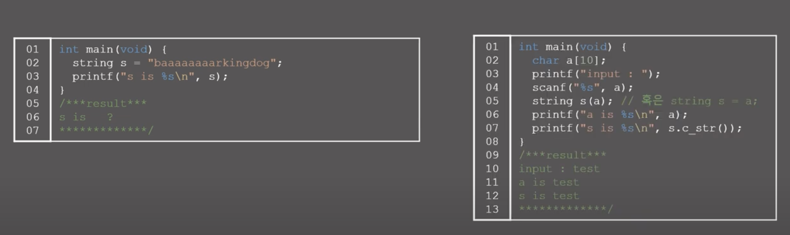  

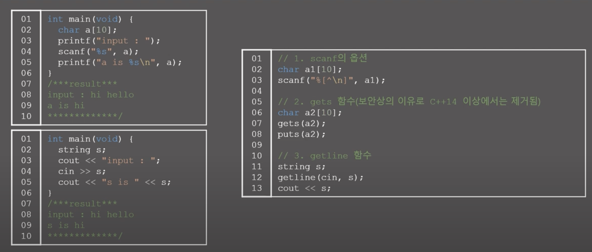  

문자열 입력받을 때 `cin` 은 공백에서 끊기 때문에, `getline` 사용할 것.

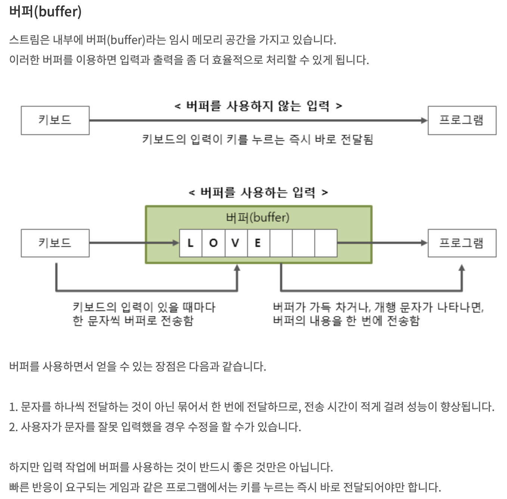  

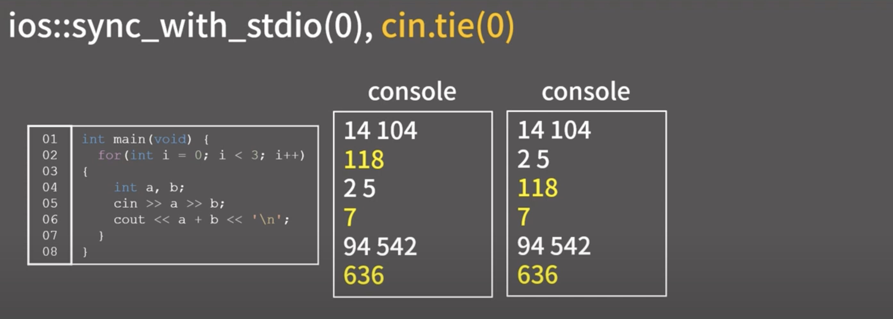  

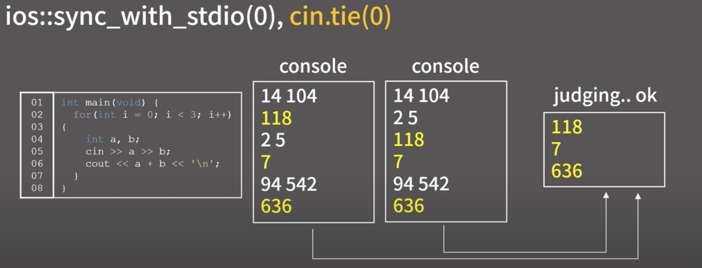  

전자는 c++ 이 아닌 c 의 입출력 스트림을 끊어버리는 것. 일반적으로 clang 은 c/c++ 동시에 사용할 수 있도록 되어 있기 때문에, 입출력 스트림이 동기화되어 있다. 따라서 c++ 에서 문자열 입력시, 매번 c와 싱크해주는 작업이 수반되므로 TC 입력 시, 시간초과 날 수 있다. 해당 명령어는 이런 스트림 동기화를 끊으므로, 실행 후에는 cout 만 사용할 것!  

후자는 출력 버퍼를 계속 열어두겠다는 뜻. 일반적으로 버퍼란 사용자의 인터페이스에 최적화된 환경으로 개행문자나 특정 조건 만족시 버퍼에 들어간 문자열을 모두 비우므로서 스트림에 전달되는 구조이지만, 채점 저지 사이트에서는 입력 따위 보일 필요도 없고 알 바가 아니기 때문에, 출력에만 신경쓴다. 그니깐, 출력   버퍼를 열어두므로서 초기 화를 매번하는 상황을 피하므로서 시간을 번다. 

  

줄바꿈과 출력 버퍼를 비워주는 행동이기 때문에,, 기껏 위에 실행한 명령어가 의미가 없어지게 된다. 

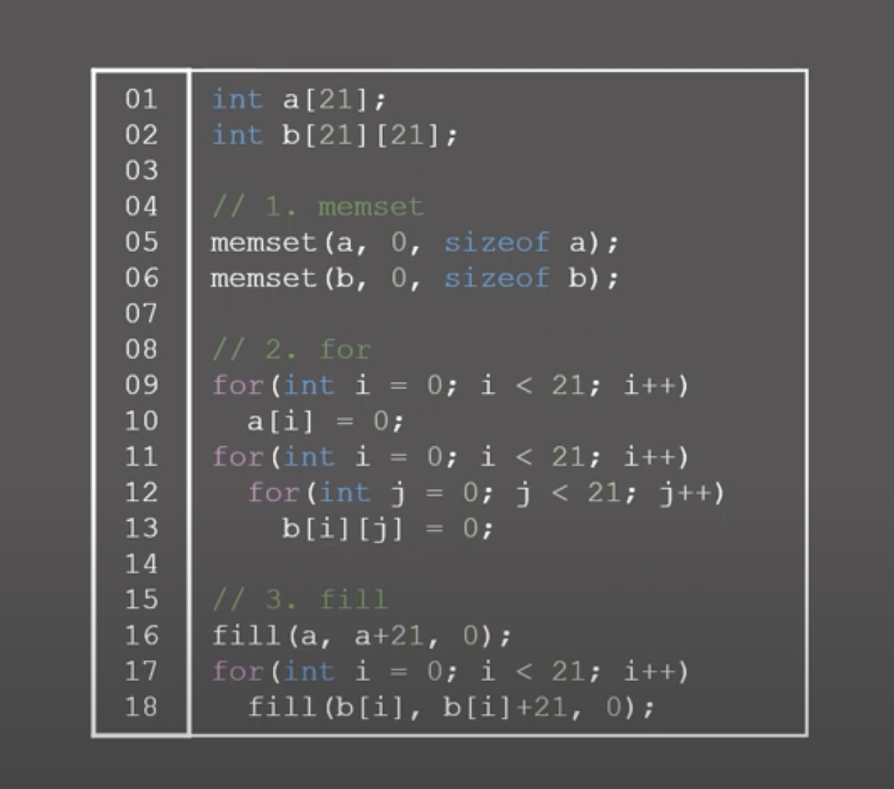  

배열 초기화 방법.  
첫번째는 음,, 0 혹은 -1 로 전달하지 않으면 오동작의 여지가 있음.
두번째는 for 을 통한 초기화으로 언제나 사용 가능 능지
세번째는 fill 함수를 이용한 방법으로 제일 쉽고 간편함.
그리고 전역에 배열 선언하면 자동으로 0 으로 초기화됨.

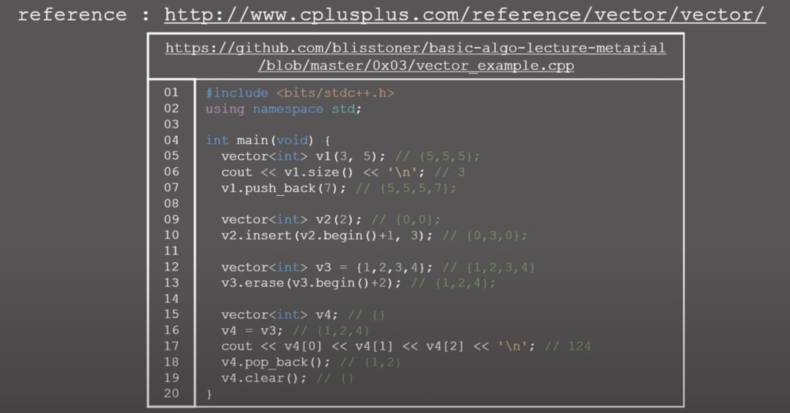  

stl vector 관한 일반적인 사항. 구현한 insert 및 erase 기능들이 만들어져 있다. 특히 = 연산자 사용시 deepcopy 이므로 원본에는 영향이 없다. 다만, 역시 O(N) 의 시간복잡도가 지연됨을 유의할 것. 

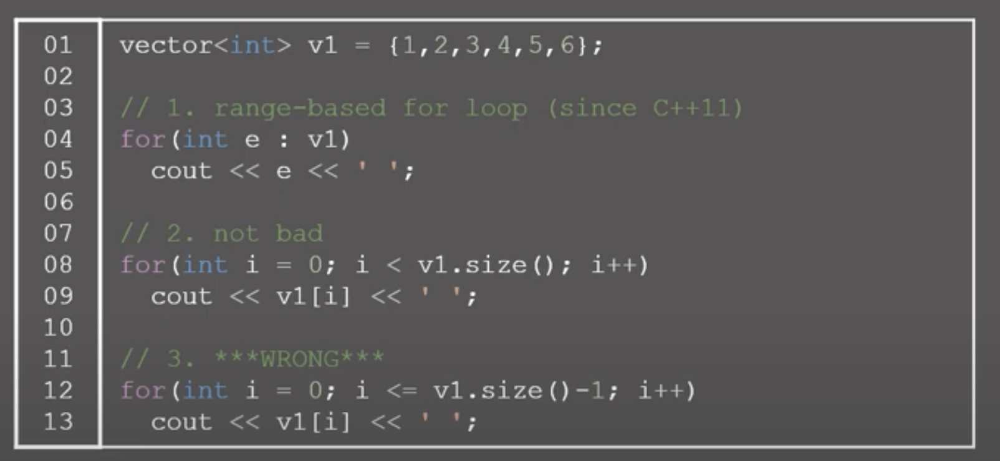  

  

for 문을 직관적으로 사용하는 예시가 제시. 다만 위의 e에서 &을 붙이면 값을 변경할 수 있다.

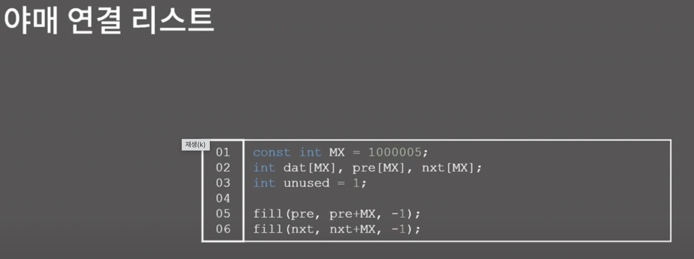  

야매 연결 리스트 외워두기!!

5
1 23 53 77 60

:colorscheme 

vv

